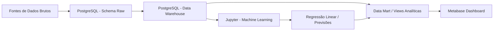

# 🇧🇷 Fatores Socioeconômicos da Criminalidade no Brasil

## 📊 Visão Geral

Este projeto tem como objetivo analisar e prever incidentes de segurança pública no Brasil combinando indicadores socioeconômicos como **Índice de Desenvolvimento Humano Municipal (IDHM)**, **crescimento populacional** e **níveis de educação**.

O objetivo é entender como essas variáveis influenciam as taxas de criminalidade e apoiar a **tomada de decisão orientada por dados** para governos e organizações.

---

## 🎯 Objetivos

* Analisar a relação entre **taxas de criminalidade e fatores socioeconômicos**
* Avaliar o impacto da **educação (INEP/IBGE)** na segurança pública
* Construir um **modelo preditivo** para tendências de criminalidade ao longo do tempo
* Gerar insights para apoiar **alocação de recursos e estratégias de prevenção**

---

## 🧠 Perguntas-Chave

* Regiões com menores níveis de educação apresentam maiores taxas de criminalidade?
* Como o crescimento populacional impacta a segurança pública?
* A educação tem maior correlação com a redução da criminalidade do que o IDHM?
* Quais regiões apresentam maior risco ao longo do tempo?

---

## 🏗️ Arquitetura



---

## 🧰 Stack Tecnológica

* **Python** (Pandas, NumPy, Scikit-learn)
* **Jupyter Notebook** (modelagem, experimentos e Machine Learning)
* **PostgreSQL** (dados brutos, Data Warehouse dimensional e Data Marts)
* **pgAdmin** (administração do banco de dados)
* **Metabase** (dashboards e análise de KPIs)
* **Docker & Docker Compose** (ambiente local)
* **Git & GitHub** (colaboração)

---

## 📂 Estrutura do Projeto

```text
.
├── docker-compose.yml
├── docker/
├── README.md
├── datasets/
├── notebooks/
│   └── 01_machine_learning_baseline.ipynb
├── postgres-init/
│   ├── 01-create_and_populate_raw.sql
│   ├── 02-create_and_populate_dw.sql
│   ├── 03-create_datamart.sql
│   └── README.md
├── metabase-data/
├── docs/
└── src/
```

---

## 📊 Fontes de Dados

* Dados de Segurança Pública (criminalidade) - https://forumseguranca.org.br/publicacoes/anuario-brasileiro-de-seguranca-publica/
* Dados de IDHM - http://www.atlasbrasil.org.br/consulta/planilha
* Dados populacionais - https://basedosdados.org/dataset/1e2b9a88-9dc7-4f0e-a3a5-e8d2a13869bf?table=1a8d9636-c11d-443b-ae83-1b00576f0b70
* Dados educacionais do Ministério da Educação - https://qedu.org.br/brasil/baixar-dados?7&brasil

---

## ⚙️ Configuração (Docker)

### 1. Clonar o repositório

```bash
git clone https://github.com/your-username/your-repo.git
cd your-repo
```

### 2. Subir os containers

```bash
docker compose up -d --build
```

---

## 🔗 Serviços

| Serviço          | URL                   |
| ---------------- | --------------------- |
| Jupyter Notebook | http://localhost:8888 |
| PostgreSQL       | localhost:5432        |
| pgAdmin          | http://localhost:8081 |
| Metabase         | http://localhost:3000 |

Nomes dos serviços no Docker Compose:

* `postgres-service`
* `pgadmin-service`
* `jupyter-service`
* `metabase-service`

---

## 🔬 Metodologia

### 1. Carga dos Dados Brutos

* Ler arquivos originais da pasta `datasets/`
* Criar o schema `raw` no PostgreSQL
* Carregar os CSVs em tabelas brutas
* Preservar a estrutura original das fontes sempre que possível

---

### 2. Tratamento e Modelagem Dimensional

* Padronizar formatos e nomes de municípios
* Integrar bases por `código do município + ano`
* Criar dimensões e tabela fato no schema `dw`
* Aplicar boas práticas de modelagem dimensional

---

### 3. Engenharia de Features

* Taxa de crimes por 100 mil habitantes
* Taxa de crescimento populacional
* Indicadores educacionais
* Indicadores de IDHM
* Índice de risco

---

### 4. Modelagem

Usamos um modelo de **Regressão Linear** como primeiro baseline para prever taxas de criminalidade:

$$
crime\_rate = f(IDHM, População, Educação, Tempo)
$$

---

### 5. Data Warehouse

O PostgreSQL organiza o pipeline analítico em schemas:

* `raw`: dados brutos ou quase brutos
* `dw`: modelo dimensional limpo, padronizado e integrado com fatos e dimensões
* `datamart`: views analíticas preparadas para BI e Machine Learning

---

### 6. Visualização

Dashboards construídos no **Metabase**:

* Distribuição regional da criminalidade
* Análise de correlação
* Ranking de risco
* Tendências ao longo do tempo
* Monitoramento de KPIs

---

## 🤝 Colaboração

Cada integrante do grupo é responsável por uma área específica:

* Engenharia de Dados (ETL SQL, PostgreSQL e publicação no DW)
* Machine Learning
* Modelagem de Banco de Dados
* Dashboards & Visualização
* Documentação

### Fluxo de Trabalho

* Branches por funcionalidade
* Pull Requests
* Revisões de código

---

## ⚠️ Limitações

* Variáveis socioeconômicas ainda limitadas
* Possíveis inconsistências entre fontes de dados
* Premissas do modelo linear
* Correlação ≠ causalidade

---

## 🚀 Melhorias Futuras

* Adicionar novas variáveis, como renda e desemprego
* Testar modelos avançados, como ARIMA, Prophet ou modelos baseados em árvores
* Criar scripts de produção para treinamento e versionamento de modelos
* Criar uma API para disponibilizar previsões

---

## 💡 Impacto Esperado

Este projeto permite:

* Melhor **alocação de recursos**
* **Ações preventivas** em regiões de maior risco
* Decisões de **política pública orientadas por dados**

---

## 📄 Licença

Este projeto é destinado a fins educacionais e de pesquisa.

---

## 👤 Autores

* Paulo Paniago 
* Marcelo Kobayashi
* Dimitri Cinnanti
