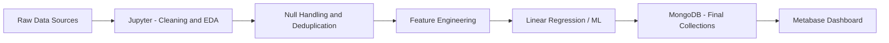

# 🇧🇷 Socioeconomic Drivers of Crime in Brazil

## 📊 Overview

This project aims to analyze and predict public safety incidents in Brazil by combining socioeconomic indicators such as **Human Development Index (HDI)**, **population growth**, and **education levels**.

The goal is to understand how these variables influence crime rates and support **data-driven decision-making** for governments and organizations.

---

## 🎯 Objectives

* Analyze the relationship between **crime rates and socioeconomic factors**
* Evaluate the impact of **education (INEP/IBGE)** on public safety
* Build a **predictive model** for crime trends over time
* Provide insights to support **resource allocation and prevention strategies**

---

## 🧠 Key Questions

* Do regions with lower education levels have higher crime rates?
* How does population growth impact public safety?
* Is education more correlated with crime reduction than HDI?
* Which regions are at higher risk over time?

---

## 🏗️ Architecture



---

## 🧰 Tech Stack

* **Python** (Pandas, NumPy, Scikit-learn)
* **Jupyter Notebook** (EDA, cleaning, feature engineering, modeling)
* **MongoDB** (Storage for treated data, final collections, and predictions)
* **Mongo Express** (Database visualization)
* **Metabase** (Dashboards and KPI analysis)
* **Docker & Docker Compose** (Environment setup)
* **Git & GitHub** (Collaboration)

---

## 📂 Project Structure

```text
.
├── docker-compose.yml
├── README.md
├── datasets/
├── notebooks/
│   ├── 01_exploracao_dados.ipynb
│   ├── 02_limpeza_tratamento.ipynb
│   ├── 03_integracao_feature_engineering.ipynb
│   ├── 04_modelagem_regressao_linear.ipynb
│   └── 05_exportacao_mongodb.ipynb
├── db-seed/
├── metabase-data/
├── docs/
└── src/
```

---

## 📊 Data Sources

* Public Safety Data (criminality datasets)
* HDI Data
* Population Data
* Education Data from Ministério da Educação / INEP / IBGE

---

## ⚙️ Setup (Docker)

### 1. Clone the repository

```bash
git clone https://github.com/your-username/your-repo.git
cd your-repo
```

### 2. Start containers

```bash
docker compose up -d
```

---

## 🔗 Services

| Service             | URL                   |
| ------------------- | --------------------- |
| Jupyter Notebook    | http://localhost:8888 |
| MongoDB             | localhost:27017       |
| Mongo Express       | http://localhost:8081 |
| Metabase            | http://localhost:3000 |

Docker Compose service names:

* `mongo-service`
* `mongo-express-service`
* `jupyter-service`
* `metabase-service`

---

## 🔬 Methodology

### 1. Data Cleaning

* Read raw files from `datasets/`
* Handle missing values
* Remove duplicates
* Normalize formats
* Align datasets by `state + year`

---

### 2. Feature Engineering

* Crime rate per 100k inhabitants
* Population growth rate
* Education indicators
* Time-based features

---

### 3. Modeling

We use a **Linear Regression model** as the first baseline to predict crime rates:

$$
crime\_rate = f(HDI, Population, Education, Time)
$$

---

### 4. Data Storage

MongoDB is used to:

* Store treated datasets
* Save final collections
* Keep model outputs and predictions

---

### 5. Visualization

Dashboards built in **Metabase**:

* Regional crime distribution
* Correlation analysis
* Risk ranking
* Trends over time
* KPI monitoring

---

## 🤝 Collaboration

Each team member is responsible for a specific area:

* Data Engineering (ETL, cleaning, MongoDB publishing)
* Machine Learning
* Database Modeling
* Dashboard & Visualization
* Documentation

### Workflow

* Feature branches
* Pull Requests
* Code reviews

---

## ⚠️ Limitations

* Limited socioeconomic variables
* Possible data inconsistencies across sources
* Linear model assumptions
* Correlation ≠ causation

---

## 🚀 Future Improvements

* Add more variables (income, unemployment)
* Use advanced models (ARIMA, Prophet)
* Move reusable transformations from notebooks into production code
* Deploy API for predictions

---

## 💡 Business Impact

This project enables:

* Better **resource allocation**
* **Preventive actions** in high-risk areas
* Data-driven **public policy decisions**

---

## 📄 License

This project is for educational and research purposes.

---

## 👤 Author

Paulo Paniago & Team
